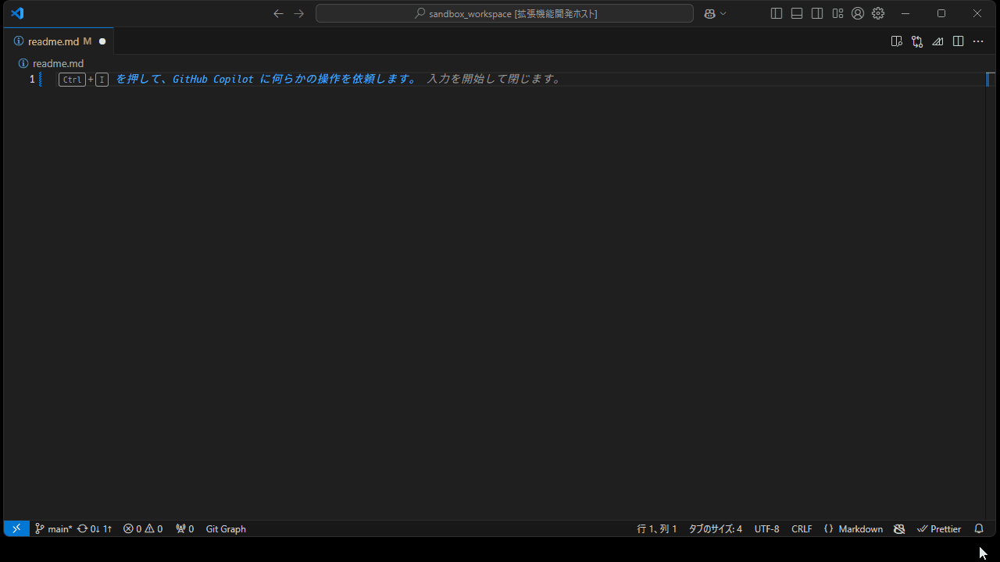

# README
This extension, "quick-paste-as-drawio-svg," is designed to enhance the Visual Studio Code experience by allowing users to quickly paste content as Draw.io SVG images. 

## Requirements
- vscode: 1.95 or higher
- OS: Windows only(sorry)

## How to use
1. Copy image data into clipboard
1. Call `quick-paste-as-drawio-svg.create-new-drawio-svg` (You can assign as keyboard short cut)
1. This extension will create a *.drawio.svg file and paste a markdown link  
	NOTE:   
	- If clipboard type is `text`, this extension will paste as a plain text.
1. Click markdown link, written *.drawio.svg
1. Open drawio extension's editor
1. Paste a image data in this drawio extension's editor
1. Done  	

## Extension Settings
- quick-paste-as-drawio-svg.img-dir
	- Type: string
	- Default: "img"
	- Description: Specifies the directory where the Draw.io SVG files will be created.

- quick-paste-as-drawio-svg.img-file-prefix
	- Type: string
	- Default: "temp"
	- Description: Specifies the prefix for the Draw.io SVG files.

## Known Issues
- 

